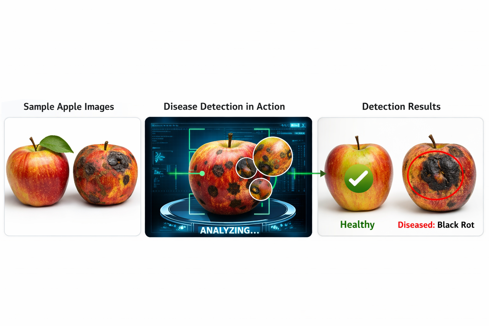

# 🍎 Apple Fruit Disease Detection System using Deep Learning

  

## 📌 Project Overview
This project is an AI-based web application that detects diseases in apple fruits using Deep Learning (EfficientNet-based CNN model). Users can upload apple fruit images and the system predicts the disease along with confidence score and prevention steps.

The system also includes user authentication, role-based access (Admin/User), prediction history, and profile management.

---

## 🧠 Objective
To help farmers and users identify apple fruit diseases at an early stage using an automated AI system, improving crop quality and reducing losses.

---

## 📊 Dataset Collection
The dataset was collected from multiple sources:
- Kaggle
- Mendeley
- Other agricultural image datasets

It includes labeled images of apple fruits under different disease categories.

---

## 🤖 Machine Learning Model

- Model Type: Convolutional Neural Network (CNN)
- Architecture: EfficientNet-based model
- Framework: TensorFlow / Keras
- Training Platform: Google Colab
- Model Format: `.keras`

### 📈 Performance Metrics:
- Training Accuracy: ~85%
- Validation Accuracy: ~87%

### 📊 Classification Report:

| Class            | Precision | Recall | F1-score | Support |
|------------------|----------|--------|----------|---------|
| Anthracnose      | 0.66     | 0.75   | 0.70     | 69      |
| Black Pox        | 0.97     | 0.97   | 0.97     | 92      |
| Black Rot        | 0.82     | 0.74   | 0.78     | 134     |
| Healthy          | 0.95     | 0.94   | 0.95     | 143     |
| Powdery Mildew   | 0.91     | 0.94   | 0.92     | 104     |

Overall Accuracy: **87%**

---

## 🛠️ Technologies Used

### 🔹 Frontend:
- HTML
- CSS
- JavaScript

### 🔹 Backend:
- Python (Flask Framework)
- SQLite Database

### 🔹 Machine Learning:
- TensorFlow / Keras
- EfficientNet
- NumPy
- PIL (Image Processing)

### 🔹 Deployment:
- Google Colab (Model Training)
- Ngrok (Public Flask URL)

---

## 🌐 Web Application Features

### 👤 User Features:
- User Signup & Login
- Upload apple fruit image
- Get disease prediction
- View prediction history
- Profile management
- Logout system

### 🧑‍💼 Admin Features:
- Admin login
- View all user predictions
- Manage system history
- Admin can delete user records from the database (history table) when required.
- Monitor users

---

## 🔁 System Workflow

1. User registers / logs in
2. Uploads apple fruit image
3. Image is preprocessed (224x224 resize + normalization)
4. EfficientNet-based CNN model predicts disease
5. Result is displayed with confidence score
6. Data is stored in SQLite database
7. User can view history in dashboard

---

## 🧪 Model Pipeline

- Input Image → Resize (224x224)
- Preprocessing using EfficientNet
- Feature extraction using CNN layers
- Softmax classification
- Output: Disease label + confidence

---

## 🗄️ Database Design (SQLite)

### Users Table:
- id
- email
- password
- role (admin/user)

### History Table:
- id
- username (email)
- image path
- prediction
- confidence
- date

---

## 🚀 Deployment

- Flask backend hosted locally
- Ngrok used for public URL access
- Model trained in Google Colab
- `.keras` model integrated into Flask

---

## 📸 User Interface (UI)

The system includes:

- Home Page
- Login Page
- Signup Page
- Dashboard (Prediction screen)
- History Page
- Profile Page
- Admin Panel

---

## 👤 Author
- HEMALATHA SIVAKAI
- Email: sivakavihemalatha@gmail.com
